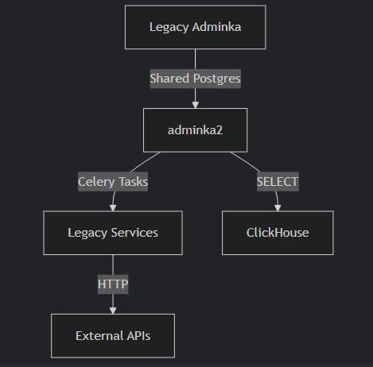

# overview (feed to LLM)

# admin2: Project Vision & Structural Philosophy

***

## Core Intentions

### What Problems Are We Solving?

1. **Legacy System Fragility - rewriting the code**
   * Current codebase is a "house of cards" – modifying one service breaks unrelated features.
   * 14 microservices with hidden dependencies, 0 documentation.
2. **Latency & Poor Performance**
   * Services communicate over HTTP across 3+ servers (e.g., `87.249.37.86` ↔ `185.175.47.222`).
   * Example: A single user action triggers 17 functions across 3 services.
3. **Maintainability Crisis**
   * No separation of concerns (e.g., business logic mixed with API calls).
   * Impossible to onboard new developers.
4. **Lack of Observability**
   * No logging, monitoring, or error tracking.

***

## Strategic Goals for admin2

### North Star Principles

1. **Controlled Decoupling**
   * Group tightly coupled services (e.g., `upload`, `parser`, `normalize_brands`) into **modular Django apps**.
   * Keep truly independent services (e.g., billing) separate.
2. **Eliminate Hidden Dependencies**
   * Enforce boundaries using Django’s `AppConfig` and `ready()`.
   * Example: If `parser` needs data from `upload`, use **explicit events** (Celery tasks) instead of direct imports.
3. **Hybrid Transition**
   * Run `admin2` alongside legacy systems indefinitely.
   * Gradually "strangle" legacy services by rerouting traffic to Django apps.
4. **Documentation by Design**
   * Treat documentation as a core feature (e.g., docstrings, architecture diagrams).

***

## Tech Stack & Roles in Solving Legacy Issues

| **Tool**           | **Purpose**                                    | **Legacy Pain Addressed**                            |
| ------------------ | ---------------------------------------------- | ---------------------------------------------------- |
| **Django**         | Core backend framework.                        | Centralizes fragmented logic into apps.              |
| **HTMX/AlpineJS**  | Dynamic UI without JavaScript bloat.           | Replaces chaotic jQuery/vanilla JS.                  |
| TailwindCSS        | Styling                                        | raw disjointed css                                   |
| **django-cotton**  | Reusable server-rendered components.           | Standardizes UI across legacy + new.                 |
| **Celery + Redis** | Async task processing.                         | Replaces inter-service HTTP calls.                   |
| **Nginx**          | Reverse proxy, routing, SSL.                   | Simplifies endpoint management (e.g., `/v2/upload`). |
| **Postgres**       | Auth, transactional data (shared with legacy). | Avoids migration headaches.                          |
| **ClickHouse**     | Analytics (direct `SELECT` queries).           | Leverages existing infrastructure.                   |
| **Grafana**        | Monitoring/alerting.                           | Replaces "failing silently" culture.                 |
| **uv**             | Fast dependency management.                    | Stabilizes Python package workflows.                 |

***

## Current Infrastructure (Simplified)

### Pain Points

* **Adminka**:
  * Directly calls 6+ microservices via HTTP.
  * Mixes ClickHouse (analytics) and Postgres (auth) queries.
* **Services**:
  * No error handling (e.g., HTTP calls fail silently).
  * Shared global state (e.g., `dif.emex_brands` table used by 4 services).

***

## admin2’s Architectural Pillars

### 1. Modular Django Apps as "Pseudo-Services"

* **Core App**:
  * Houses shared UI components (buttons, tables) reused from legacy adminka.
  * Contains third-party utilities (pandas, numpy, ClickHouse connectors).
* **Rule**: Apps *never* import models/signals from other apps directly.
* **Enforcement**:
  ```python
  # parser/apps.py  
  class ParserConfig(AppConfig):  
      def ready(self):  
          # All parser-specific initialization (signals, clients) lives HERE  
          from . import signals  # No cross-app imports at top level!  
  ```

### 2. Hybrid Transition Mechanics

* **Database Sharing**:
  * `admin2` uses the **same Postgres DB and ClickHouse** as legacy (shared credentials/tables).
* **Coexistence**:
  * Legacy adminka and admin2 will co-exist for 12+ monhts

### 3. Testing & Observability

* **Testing**:
  * **Smart Coverage**: Prioritize critical user flows (e.g., file upload → parser).
  * **Integration Tests**: Ensure Django ↔ legacy HTTP adapters work.
  * Pytest for unit testing
* **Observability**:
  * **Grafana**: Monitor server health, Celery queues, DB performance.
  * **Sentry (Free Tier)**: Error tracking for Django/Celery.
  * **Structured Logs**: maybe using loguru for logging

### 4. Dependency Management

* **Core App**: Centralizes shared code (e.g., API clients, utils).
* **Third-Party Libraries**:
  * Use existing tools (pandas, numpy) where necessary.
  * Enforce `uv` for dependency resolution and virtual environments.

***

## Non-Negotiables

### What We **Won’t** Compromise On

1. **No "Big Bang" Rewrite**: Legacy and Django code will coexist for 12+ months.
2. **No Tight Coupling**: If `upload` and `parser` apps grow interdependent, merge them into one app.
3. **No Undocumented Features**: Every PR must update architecture diagrams.

***

## Success Metrics

1. **Stability**:
   * Reduce "fix one thing, break another" incidents by 80% in 6 months.
2. **Velocity**:
   * Deploy new features in days (not weeks).
3. **Onboarding**:
   * New developers become productive in ≤3 days.


## Appendices

### Key Diagrams

```graphql
graph TD
  A[Legacy Adminka] -->|Shared Postgres| B[admin2]
  B -->|Celery Tasks| C[Legacy Services]
  B -->|SELECT| D[ClickHouse]
  C -->|HTTP| E[External APIs]
```



