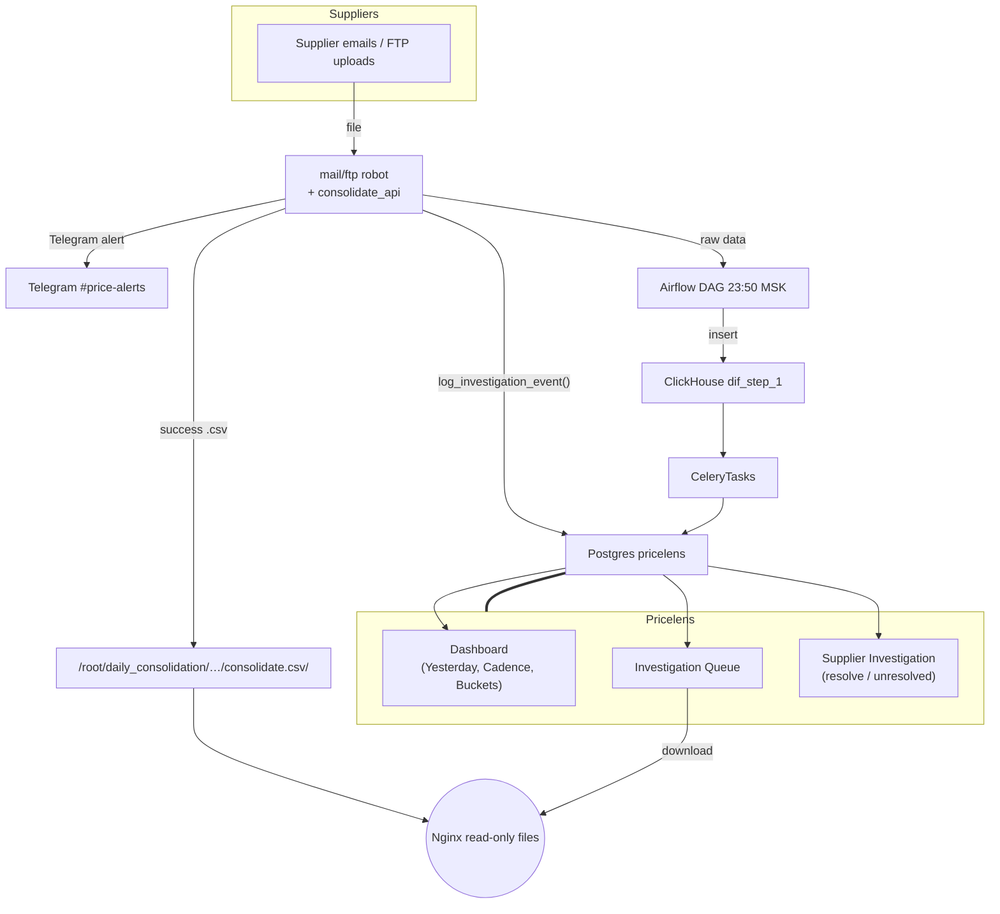

# Pricelens — Blueprint (v0‑MVP)

```
Host A (Django + Celery + Postgres)  : 87.249.37.86
Host B (File storage + Nginx)       : 87.242.110.159
ClickHouse (data warehouse)         : existing cluster
Timezone everywhere                 : Europe/Moscow
```

---

## Contents

1. [Overview & data‑flow](#1-overview--data-flow)
2. [Postgres models & migrations](#2-postgres-models--migrations)
3. [ClickHouse queries & daily materialisation](#3-clickhouse-queries--daily-materialisation)
4. [Celery beat tasks](#4-celery-beat-tasks)
5. [Django plumbing (settings, urls, views, templates)](#5-django-plumbing-settings-urls-views-templates)
6. [log\_investigation\_event() hook](#6-loginvestigation_event-hook)
7. [Nginx read‑only file server (Host B)](#7-nginx-read-only-file-server-host-b)
8. [Environment / dependency checklist](#8-environment--dependency-checklist)
9. [Future extensions](#9-future-extensions)

---

## 1. Overview & data‑flow


**Key jobs**

| Job                         | Trigger                   | Writes                             | Reads                                             |
| --------------------------- | ------------------------- | ---------------------------------- | ------------------------------------------------- |
| `refresh_cadence_profiles`  | daily 06:30 MSK           | `cadence_profile`, `cadence_daily` | ClickHouse `dif_step_1`                           |
| `backfill_investigations`   | daily 06:35 MSK           | `investigation` (status=open)      | ClickHouse `dif_errors`, Postgres `investigation` |
| `log_investigation_event()` | runtime in error handlers | inserts into `investigation`       | —                                                 |

---

## 2. Postgres models & migrations

Create Django app:

```bash
python manage.py startapp pricelens
```

### `pricelens/models.py`

```python
from django.db import models
from uuid import uuid4


class InvestigationStatus(models.IntegerChoices):
    OPEN = 0, "open"
    RESOLVED = 1, "resolved"
    UNRESOLVED = 2, "unresolved"


class Investigation(models.Model):
    id = models.UUIDField(primary_key=True, default=uuid4, editable=False)
    event_dt = models.DateTimeField(db_index=True)
    supid = models.PositiveIntegerField(db_index=True)
    error_id = models.PositiveIntegerField(db_index=True)
    error_text = models.CharField(max_length=128)
    stage = models.CharField(max_length=32)          # load_mail / load_ftp / consolidate / airflow
    file_path = models.TextField(blank=True, default="")
    status = models.IntegerField(choices=InvestigationStatus.choices,
                                 default=InvestigationStatus.OPEN,
                                 db_index=True)
    note = models.TextField(blank=True, default="")
    investigated_at = models.DateTimeField(null=True, blank=True)
    investigator = models.CharField(max_length=128, blank=True, default="")
    created_at = models.DateTimeField(auto_now_add=True)

    class Meta:
        indexes = [
            models.Index(fields=["status", "event_dt"]),
            models.Index(fields=["supid", "event_dt"]),
        ]


class CadenceDaily(models.Model):
    date = models.DateField(db_index=True)
    supid = models.PositiveIntegerField(db_index=True)
    had_file = models.BooleanField(default=False)
    attempts = models.PositiveIntegerField(default=0)
    errors = models.PositiveIntegerField(default=0)
    last_stage = models.CharField(max_length=32, blank=True, default="")

    class Meta:
        unique_together = ("date", "supid")


class CadenceProfile(models.Model):
    supid = models.PositiveIntegerField(primary_key=True)
    median_gap_days = models.PositiveIntegerField()
    sd_gap = models.FloatField()
    days_since_last = models.PositiveIntegerField()
    last_success_date = models.DateField()
    bucket = models.CharField(max_length=16)     # consistent / inconsistent / dead
    updated_at = models.DateTimeField(auto_now=True)
```

Run:

```bash
python manage.py makemigrations pricelens
python manage.py migrate pricelens
```

---

## 3. ClickHouse queries & daily materialisation

> Use the **read‑only** user credentials your Django project already has.

### 3.1 Success calendar per supplier (180 days)

```sql
/* CH view (optional) */
CREATE OR REPLACE VIEW sup_stat.success_days_180 AS
SELECT
    supid,
    dateupd AS d
FROM sup_stat.dif_step_1
WHERE dateupd >= today() - 180
GROUP BY supid, d;
```

### 3.2 Cadence profile query (used by Celery task)

```sql
WITH by_sup AS
(
    SELECT
        supid,
        arraySort(groupArray(d)) AS days
    FROM sup_stat.success_days_180
    GROUP BY supid
),
stats AS
(
    SELECT
        supid,
        arrayFilter(x -> x > 0,
            arrayMap(i -> dateDiff('day', days[i-1], days[i]), arrayEnumerate(days))
        )                                     AS gaps,
        arrayReduce('quantileExact(0.5)', gaps) AS med_gap,
        arrayReduce('stddevPop', gaps)          AS sd_gap,
        dateDiff('day', arrayMax(days), today()) AS days_since_last,
        arrayMax(days)                           AS last_success_date
    FROM by_sup
)
SELECT *
FROM stats
WHERE length(gaps) >= 1;   -- skip suppliers with <2 successes
```

Python side will:

```python
bucket = (
    "dead" if days_since_last >= 28
    else "consistent" if sd_gap <= med_gap * 0.5
    else "inconsistent"
)
```

### 3.3 Yesterday’s failures (top reasons & queue)

```sql
SELECT
    d.error_text,
    count() AS cnt
FROM sup_stat.dif_errors e
LEFT JOIN sup_stat.error_list d ON d.id = e.error_id
WHERE e.dt >= toDateTime(yesterday())
  AND e.dt <  toDateTime(today())
GROUP BY d.error_text
ORDER BY cnt DESC
LIMIT 5;
```

The queue query is the same plus a left‑anti join to Postgres `investigation` (done in Python).

---

## 4. Celery beat tasks

Add to **`celery.py`** if not already:

```python
from celery.schedules import crontab

app.conf.beat_schedule.update({
    "refresh_cadence_profiles": {
        "task": "pricelens.tasks.refresh_cadence_profiles",
        "schedule": crontab(hour=6, minute=30),   # 06:30 MSK daily
    },
    "backfill_investigations": {
        "task": "pricelens.tasks.backfill_investigations",
        "schedule": crontab(hour=6, minute=35),   # 06:35 MSK daily
    },
})
```

### `pricelens/tasks.py` (skeleton)

```python
from celery import shared_task
from django.db import transaction
from django.utils import timezone
from .models import CadenceProfile, CadenceDaily, Investigation, InvestigationStatus
from django.conf import settings
import clickhouse_connect


def ch_client():
    return clickhouse_connect.get_client(
        host=settings.CLICKHOUSE_HOST,
        port=settings.CLICKHOUSE_PORT,
        username=settings.CLICKHOUSE_USER,
        password=settings.CLICKHOUSE_PASSWORD,
        database="default",
    )


@shared_task
def refresh_cadence_profiles():
    client = ch_client()
    sql = open("pricelens/sql/cadence_profile.sql").read()
    rows = client.query(sql).named_results()
    now = timezone.now()
    with transaction.atomic():
        CadenceProfile.objects.all().delete()
        objs = []
        for r in rows:
            objs.append(CadenceProfile(
                supid=r["supid"],
                median_gap_days=int(round(r["med_gap"])),
                sd_gap=float(r["sd_gap"]),
                days_since_last=r["days_since_last"],
                last_success_date=r["last_success_date"],
                bucket=(
                    "dead" if r["days_since_last"] >= 28
                    else "consistent" if r["sd_gap"] <= r["med_gap"] * 0.5
                    else "inconsistent"
                ),
                updated_at=now,
            ))
        CadenceProfile.objects.bulk_create(objs, batch_size=500)
    # CadenceDaily population (optional for v1) …


@shared_task
def backfill_investigations():
    client = ch_client()
    rows = client.query("""
        SELECT e.dt AS event_dt, e.supid, e.error_id,
               d.error_text,
               'consolidate' AS stage   -- quick heuristic; refine if needed
        FROM sup_stat.dif_errors e
        LEFT JOIN sup_stat.error_list d ON d.id = e.error_id
        WHERE e.dt >= toDateTime(yesterday())
          AND e.dt <  toDateTime(today())
    """).named_results()
    new_objs = []
    for r in rows:
        exists = Investigation.objects.filter(
            event_dt=r["event_dt"],
            supid=r["supid"],
            error_id=r["error_id"],
        ).exists()
        if not exists:
            new_objs.append(Investigation(
                event_dt=r["event_dt"],
                supid=r["supid"],
                error_id=r["error_id"],
                error_text=r["error_text"],
                stage=r["stage"],
                file_path="",        # will be filled by log_investigation_event or left blank
            ))
    Investigation.objects.bulk_create(new_objs, batch_size=500)
```

---

## 5. Django plumbing (settings, urls, views, templates)

### 5.1 `settings.py`

```python
INSTALLED_APPS += [
    "pricelens",
]

# ClickHouse creds (env vars recommended)
CLICKHOUSE_HOST = os.getenv("CH_HOST", "localhost")
CLICKHOUSE_PORT = int(os.getenv("CH_PORT", "8123"))
CLICKHOUSE_USER = os.getenv("CH_USER", "default")
CLICKHOUSE_PASSWORD = os.getenv("CH_PASS", "")
```

### 5.2 `urls.py`

```python
from django.urls import path, include
urlpatterns += [
    path("pricelens/", include("pricelens.urls")),
]
```

### 5.3 `pricelens/urls.py`

```python
from django.urls import path
from . import views

app_name = "pricelens"

urlpatterns = [
    path("", views.DashboardView.as_view(), name="dashboard"),
    path("queue/", views.QueueView.as_view(), name="queue"),
    path("investigate/<uuid:pk>/", views.InvestigationDetailView.as_view(), name="investigate"),
]
```

### 5.4 `views.py` (condensed)

```python
from django.views import generic
from .models import Investigation, CadenceProfile, InvestigationStatus
from django.db.models import Count


class DashboardView(generic.TemplateView):
    template_name = "pricelens/dashboard.html"

    def get_context_data(self, **kwargs):
        ctx = super().get_context_data(**kwargs)
        yesterday_open = Investigation.objects.filter(
            status=InvestigationStatus.OPEN,
            event_dt__date=timezone.now().date() - datetime.timedelta(days=1)
        )
        top = (yesterday_open
               .values("error_text")
               .annotate(cnt=Count("id"))
               .order_by("-cnt")[:5])
        ctx.update({
            "failures": yesterday_open.count(),
            "suppliers": yesterday_open.values("supid").distinct().count(),
            "top_reasons": list(top),
            "buckets": CadenceProfile.objects.values("bucket")
                         .annotate(cnt=Count("supid")),
            "anomalies": CadenceProfile.objects.filter(
                days_since_last__gt=models.F("median_gap_days") * 2).order_by("-days_since_last")[:50],
        })
        return ctx


class QueueView(generic.ListView):
    model = Investigation
    template_name = "pricelens/queue.html"
    paginate_by = 50

    def get_queryset(self):
        yesterday = timezone.now().date() - datetime.timedelta(days=1)
        return (Investigation.objects
                .filter(status=InvestigationStatus.OPEN,
                        event_dt__date=yesterday)
                .order_by("-event_dt"))


class InvestigationDetailView(generic.UpdateView):
    model = Investigation
    fields = ["note"]   # note editable
    template_name = "pricelens/investigate.html"

    def form_valid(self, form):
        obj = form.save(commit=False)
        action = self.request.POST.get("action")
        if action == "resolve":
            obj.status = InvestigationStatus.RESOLVED
        else:
            obj.status = InvestigationStatus.UNRESOLVED
        obj.investigated_at = timezone.now()
        obj.investigator = self.request.user.username
        obj.save()
        # Optional: flash auto-generated summary
        return redirect("pricelens:queue")
```

### 5.5 Templates (keep ultra‑light for MVP)

*`dashboard.html`* (pseudo‑code only):

```django
<h2>Yesterday: {{ failures }} failures across {{ suppliers }} suppliers</h2>
<ul>
 
   <li>{{ r.error_text }} – {{ r.cnt }}</li>
 
</ul>

<h3>Consistency buckets</h3>
<ul>
  
     <li>{{ b.bucket }}: {{ b.cnt }}</li>
  
</ul>

<h3>Anomalies</h3>
<table>
 
   <tr><td>{{ p.supid }}</td><td>{{ p.days_since_last }} days since last</td></tr>
 
</table>
```

*`queue.html`* – simple table with link to investigate.

*`investigate.html`* – header + explanation + **Download** link:

```django
<a href="http://87.242.110.159{{ object.file_path|urlencode }}">Download source</a>
<a href="/admin/app/supplier/{{ object.supid }}/change/">Open in admin</a>
<form method="post">
  
  {{ form.as_p }}
  <button name="action" value="resolve">Resolved</button>
  <button name="action" value="unresolve">Could not resolve</button>
</form>
```

---

## 6. `log_investigation_event()` hook

Add to a common util (`pricelens/utils.py`):

```python
from pricelens.models import Investigation, InvestigationStatus
from django.utils import timezone
from django.db import IntegrityError

def log_investigation_event(event_dt, supid, reason, stage, file_path, extra=None):
    try:
        Investigation.objects.get_or_create(
            event_dt=event_dt,
            supid=supid,
            error_id=reason.value if hasattr(reason, "value") else int(reason),
            defaults={
                "error_text": reason.name if hasattr(reason, "name") else str(reason),
                "stage": stage,
                "file_path": file_path,
                "status": InvestigationStatus.OPEN,
                "created_at": timezone.now(),
            }
        )
    except IntegrityError:
        pass  # already inserted elsewhere
```

Use in your existing error branches:

```python
log_investigation_event(
    event_dt=datetime.datetime.now(),
    supid=supid,
    reason=FailReasons.FILE_READ_ERROR,
    stage="load_mail",
    file_path=file_path,
)
send_message_to_chat(message)
save_failed_file(supid, file_path, reason)
```

---

## 7. Nginx read‑only file server (Host B – 87.242.110.159)

`/etc/nginx/conf.d/pricelens_static.conf`

```nginx
server {
    listen 80;
    server_name 87.242.110.159;

    autoindex off;

    location /mail_backup/ {
        alias /root/mail_backup/;
        add_header Content-Disposition "attachment";
    }
    location /ftp_backup/ {
        alias /root/ftp_backup/;
        add_header Content-Disposition "attachment";
    }
    location /daily_consolidation/ {
        alias /root/daily_consolidation/;
        add_header Content-Disposition "attachment";
    }

    # Restrict to Django host IP (optional)
    # allow 87.249.37.86;
    # deny all;
}
```

Reload Nginx:

```bash
sudo nginx -t && sudo systemctl reload nginx
```

---

## 8. Environment / dependency checklist

| Component                    | Version / Package                | Notes                      |
| ---------------------------- | -------------------------------- | -------------------------- |
| Django                       | ≥ 3.2                            | existing project           |
| Postgres                     | existing                         | pricelens tables           |
| ClickHouse‑Connect           | `pip install clickhouse-connect` | CH client                  |
| Celery                       | existing                         | Beat schedule updated      |
| clickhouse‑driver (optional) | if you prefer                    | —                          |
| Nginx                        | existing on Host B               | read‑only file server      |
| pandas / numpy               | existing                         | consolidate\_api uses them |

Environment vars:

```
CH_HOST, CH_PORT, CH_USER, CH_PASS
SECRET_KEY, DATABASE_URL, CELERY_BROKER_URL
```

---

## 9. Future extensions

* Supplier scorecards (rolling reliability %)
* Real‑time webhook into pricelens instead of daily backfill
* Anomaly e‑mail / Telegram digest with chart attachments
* AI “blondie” assistant: ChatGPT function calling → /investigate/**id** steps
* Data‑drift widgets (row\_count z‑score, price skew)
* Multi‑tenant RBAC (Ops vs Eng vs Admin)
* Attach failed file preview / sample rows inline
