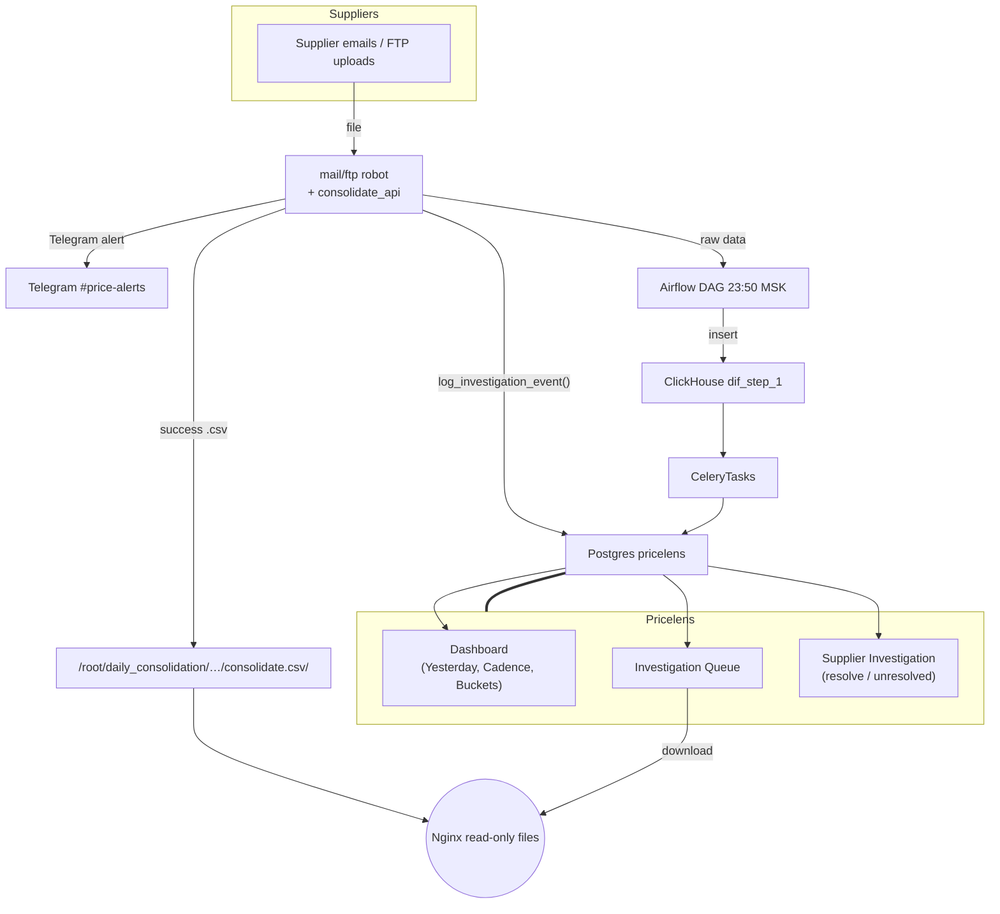

# Pricelens — Blueprint (v0‑MVP) - Project Adapted

```
Host A (Django + Celery + Postgres)  : 87.249.37.86
Host B (File storage + Nginx)       : 87.242.110.159
ClickHouse (data warehouse)         : existing cluster
Timezone everywhere                 : Europe/Moscow
```

---

## Contents

1. [Overview & data‑flow](#1-overview--data-flow)
2. [Postgres models & migrations](#2-postgres-models--migrations)
3. [ClickHouse queries & daily materialisation](#3-clickhouse-queries--daily-materialisation)
4. [Celery beat tasks](#4-celery-beat-tasks)
5. [Django plumbing (settings, urls, views, templates)](#5-django-plumbing-settings-urls-views-templates)
6. [log\_investigation\_event() hook](#6-loginvestigation_event-hook)
7. [Nginx read‑only file server (Host B)](#7-nginx-read-only-file-server-host-b)
8. [Environment / dependency checklist](#8-environment--dependency-checklist)
9. [Future extensions](#9-future-extensions)

---

## 1. Overview & data‑flow

(No changes to this section. The high-level architecture is sound.)


**Key jobs**

| Job                         | Trigger                   | Writes                             | Reads                                             |
| --------------------------- | ------------------------- | ---------------------------------- | ------------------------------------------------- |
| `refresh_cadence_profiles`  | daily 06:30 MSK           | `cadence_profile`, `cadence_daily` | ClickHouse `dif_step_1`                           |
| `backfill_investigations`   | daily 06:35 MSK           | `investigation` (status=open)      | ClickHouse `dif_errors`, Postgres `investigation` |
| `log_investigation_event()` | runtime in error handlers | inserts into `investigation`       | —                                                 |

---

## 2. Postgres models & migrations

Create Django app:

```bash
python manage.py startapp pricelens
```

### `pricelens/models.py`

> **Project Adaptation:** Added `get_download_url` property to the `Investigation` model. This removes hardcoded URLs from templates and relies on a Django setting, which is a critical improvement for maintainability.

```python
from django.db import models
from django.conf import settings
from django.utils.http import urlquote
from uuid import uuid4


class InvestigationStatus(models.IntegerChoices):
    OPEN = 0, "open"
    RESOLVED = 1, "resolved"
    UNRESOLVED = 2, "unresolved"


class Investigation(models.Model):
    id = models.UUIDField(primary_key=True, default=uuid4, editable=False)
    event_dt = models.DateTimeField(db_index=True)
    supid = models.PositiveIntegerField(db_index=True)
    error_id = models.PositiveIntegerField(db_index=True)
    error_text = models.CharField(max_length=128)
    stage = models.CharField(max_length=32)          # load_mail / load_ftp / consolidate / airflow
    file_path = models.TextField(blank=True, default="")
    status = models.IntegerField(choices=InvestigationStatus.choices,
                                 default=InvestigationStatus.OPEN,
                                 db_index=True)
    note = models.TextField(blank=True, default="")
    investigated_at = models.DateTimeField(null=True, blank=True)
    investigator = models.CharField(max_length=128, blank=True, default="")
    created_at = models.DateTimeField(auto_now_add=True)

    class Meta:
        indexes = [
            models.Index(fields=["status", "event_dt"]),
            models.Index(fields=["supid", "event_dt"]),
        ]

    @property
    def get_download_url(self) -> str:
        """Constructs the full URL to the source file on the Nginx server."""
        base_url = settings.PRICELENS_FILE_SERVER_URL
        if not base_url or not self.file_path:
            return ""
        # Use urlquote to handle special characters in file paths
        return f"{base_url.rstrip('/')}/{urlquote(self.file_path.lstrip('/'))}"


class CadenceDaily(models.Model):
    date = models.DateField(db_index=True)
    supid = models.PositiveIntegerField(db_index=True)
    had_file = models.BooleanField(default=False)
    attempts = models.PositiveIntegerField(default=0)
    errors = models.PositiveIntegerField(default=0)
    last_stage = models.CharField(max_length=32, blank=True, default="")

    class Meta:
        unique_together = ("date", "supid")


class CadenceProfile(models.Model):
    supid = models.PositiveIntegerField(primary_key=True)
    median_gap_days = models.PositiveIntegerField()
    sd_gap = models.FloatField()
    days_since_last = models.PositiveIntegerField()
    last_success_date = models.DateField()
    bucket = models.CharField(max_length=16)     # consistent / inconsistent / dead
    updated_at = models.DateTimeField(auto_now=True)
```

Run:

```bash
python manage.py makemigrations pricelens
python manage.py migrate pricelens
```

---

## 3. ClickHouse queries & daily materialisation

3.1 Success calendar per supplier (180 days)
```sql
/* CH view (optional) */
CREATE OR REPLACE VIEW sup_stat.success_days_180 AS
SELECT
    supid,
    dateupd AS d
FROM sup_stat.dif_step_1
WHERE dateupd >= today() - 180
GROUP BY supid, d;
```

3.2 Cadence profile query (used by Celery task)
```sql
WITH by_sup AS
(
    SELECT
        supid,
        arraySort(groupArray(d)) AS days
    FROM sup_stat.success_days_180
    GROUP BY supid
),
stats AS
(
    SELECT
        supid,
        arrayFilter(x -> x > 0,
            arrayMap(i -> dateDiff('day', days[i-1], days[i]), arrayEnumerate(days))
        )                                     AS gaps,
        arrayReduce('quantileExact(0.5)', gaps) AS med_gap,
        arrayReduce('stddevPop', gaps)          AS sd_gap,
        dateDiff('day', arrayMax(days), today()) AS days_since_last,
        arrayMax(days)                           AS last_success_date
    FROM by_sup
)
SELECT *
FROM stats
WHERE length(gaps) >= 1;   -- skip suppliers with <2 successes

```

Python side will:
```python
bucket = (
    "dead" if days_since_last >= 28
    else "consistent" if sd_gap <= med_gap * 0.5
    else "inconsistent"
)

```

#### Пример расчета стандартного отклонения (sd_gap)

Чтобы понять, откуда берутся значения `sd_gap`, рассмотрим пример "Хаотичного барабанщика" с промежутками `[2, 8, 3, 10, 5]`.

**Шаг 1: Находим среднее арифметическое**

Сначала мы вычисляем среднее значение (mean) для этого набора данных.

- **Сумма:** `2 + 8 + 3 + 10 + 5 = 28`
- **Количество:** 5 значений
- **Среднее:** `28 / 5 = 5.6`

**Шаг 2: Рассчитываем дисперсию (Variance)**

Далее, для каждого значения мы измеряем, насколько оно отклоняется от среднего (5.6), возводим эту разницу в квадрат, а затем находим среднее этих квадратов.

1.  `(2 - 5.6)² = (-3.6)² = 12.96`
2.  `(8 - 5.6)² = (2.4)² = 5.76`
3.  `(3 - 5.6)² = (-2.6)² = 6.76`
4.  `(10 - 5.6)² = (4.4)² = 19.36`
5.  `(5 - 5.6)² = (-0.6)² = 0.36`

Теперь находим среднее этих "квадратов отклонений":

- **Сумма квадратов:** `12.96 + 5.76 + 6.76 + 19.36 + 0.36 = 45.2`
- **Дисперсия:** `45.2 / 5 = 9.04`

**Шаг 3: Находим стандартное отклонение**

Стандартное отклонение — это просто **квадратный корень из дисперсии**. Это возвращает нас к исходной единице измерения (дням).

- **Стандартное отклонение:** `√9.04 ≈ 3.01`

Таким образом, точное значение `sd_gap` для этого примера составляет **~3.01**, что и используется для классификации поставщика как "Нестабильного".

3.3 Tables involved (DDL)
```sql
-- sup_stat.dif_step_1 definition

CREATE TABLE sup_stat.dif_step_1
(

    `dateupd` Date,

    `supid` Int32,

    `b` String,

    `a` String,

    `p` Float64,

    `q` Int32
)
ENGINE = ReplacingMergeTree
PARTITION BY toYYYYMMDD(dateupd)
ORDER BY (dateupd,
 supid,
 b,
 a)
TTL dateupd + toIntervalMonth(15)
SETTINGS index_granularity = 8192;
```

```sql
-- sup_stat.error_list definition

CREATE TABLE sup_stat.error_list
(

    `id` UInt32,

    `error_text` String
)
ENGINE = MergeTree
ORDER BY id
SETTINGS index_granularity = 8192;
```

```sql
-- sup_stat.dif_errors definition

CREATE TABLE sup_stat.dif_errors
(

    `dt` DateTime,

    `supid` UInt32,

    `error_id` UInt32
)
ENGINE = MergeTree
ORDER BY (dt,
 supid)
SETTINGS index_granularity = 8192;
```

reference table for names of suppliers (supid from other tables  = dif_id from this table). We need the name.

```sql
-- sup_stat.sup_list definition

CREATE TABLE sup_stat.sup_list
(

    `dif_id` Int32,

    `skl` String,

    `name` String,

    `post` UInt64,

    `lists` Array(String)
)
ENGINE = ReplacingMergeTree
ORDER BY dif_id
SETTINGS index_granularity = 8192
COMMENT 'post = "Delivery time (in hours)"';
```

---

## 4. Celery beat tasks

> **Project Adaptation:** The Celery schedule should be added to `config/third_party_config/celery.py`. The tasks in `pricelens/tasks.py` are modified to reuse the existing `ClickHouseService` from the `cross_dock` app, preventing code duplication.

Add to **`config/third_party_config/celery.py`**:

```python
from celery.schedules import crontab

app.conf.beat_schedule.update({
    "refresh_cadence_profiles": {
        "task": "pricelens.tasks.refresh_cadence_profiles",
        "schedule": crontab(hour=6, minute=30, day_of_week='*'),   # 06:30 MSK daily
    },
    "backfill_investigations": {
        "task": "pricelens.tasks.backfill_investigations",
        "schedule": crontab(hour=6, minute=35, day_of_week='*'),   # 06:35 MSK daily
    },
})
```

### `pricelens/tasks.py` (skeleton)

```python
from celery import shared_task
from django.db import transaction
from django.utils import timezone
from .models import CadenceProfile, CadenceDaily, Investigation, InvestigationStatus
# ADAPTED: Use the centralized ClickHouse client from common utils
from common.utils.clickhouse import get_clickhouse_client


@shared_task
def refresh_cadence_profiles():
    # ADAPTED: Use the centralized client
    with get_clickhouse_client() as client:
        # NOTE: Assumes a file at `pricelens/sql/cadence_profile.sql`
        with open("pricelens/sql/cadence_profile.sql") as f:
            sql = f.read()
        rows = client.query(sql).named_results()
        now = timezone.now()
        with transaction.atomic():
            CadenceProfile.objects.all().delete()
            objs = []
            for r in rows:
                # Basic validation
                if not r.get("med_gap") or not r.get("sd_gap"):
                    continue
                objs.append(CadenceProfile(
                    supid=r["supid"],
                    median_gap_days=int(round(r["med_gap"])),
                    sd_gap=float(r["sd_gap"]),
                    days_since_last=r["days_since_last"],
                    last_success_date=r["last_success_date"],
                    bucket=(
                        "dead" if r["days_since_last"] >= 28
                        else "consistent" if r["sd_gap"] <= r["med_gap"] * 0.5
                        else "inconsistent"
                    ),
                    updated_at=now,
                ))
            CadenceProfile.objects.bulk_create(objs, batch_size=500)
    # CadenceDaily population (optional for v1) …


@shared_task
def backfill_investigations():
    # ADAPTED: Use the centralized client
    with get_clickhouse_client() as client:
        rows = client.query("""
            SELECT e.dt AS event_dt, e.supid, e.error_id,
                   d.error_text,
                   'consolidate' AS stage   -- quick heuristic; refine if needed
            FROM sup_stat.dif_errors e
            LEFT JOIN sup_stat.error_list d ON d.id = e.error_id
            WHERE e.dt >= toDateTime(yesterday())
              AND e.dt <  toDateTime(today())
        """).named_results()
        new_objs = []
        for r in rows:
            exists = Investigation.objects.filter(
                event_dt=r["event_dt"],
                supid=r["supid"],
                error_id=r["error_id"],
            ).exists()
            if not exists:
                new_objs.append(Investigation(
                    event_dt=r["event_dt"],
                    supid=r["supid"],
                    error_id=r["error_id"],
                    error_text=r["error_text"],
                    stage=r["stage"],
                    file_path="",        # will be filled by log_investigation_event or left blank
                ))
        Investigation.objects.bulk_create(new_objs, batch_size=500)
```

---

## 5. Django plumbing (settings, urls, views, templates)

> **Project Adaptation:** This section is rewritten to match the project's multi-file settings configuration.

### 5.1 Project-Specific Settings

1.  **Register the app in `config/django_config/base.py`:**

    ```python
    # config/django_config/base.py

    LOCAL_APPS = [
        "core.apps.CoreConfig",
        "accounts.apps.AccountsConfig",
        "cross_dock.apps.CrossDockConfig",
        "pricelens.apps.PricelensConfig",  # Add this line
    ]
    ```
    *(Create `pricelens/apps.py` if `startapp` didn't make it)*
    ```python
    # pricelens/apps.py
    from django.apps import AppConfig

    class PricelensConfig(AppConfig):
        default_auto_field = "django.db.models.BigAutoField"
        name = "pricelens"
    ```

2.  **Add new environment variables in `config/env.py`:**

    ```python
    # config/env.py
    ...
    # Pricelens
    PRICELENS_FILE_SERVER_URL = env("PRICELENS_FILE_SERVER_URL", default="http://localhost:8080")
    ```

3.  **Add settings to `config/django_config/base.py`:**

    ```python
    # config/django_config/base.py
    from config.env import PRICELENS_FILE_SERVER_URL
    ...
    # After other settings...
    # Pricelens Configuration
    # ==============================================================================
    PRICELENS_FILE_SERVER_URL = PRICELENS_FILE_SERVER_URL
    ```
    *(Note: ClickHouse credentials should already be configured for the `cross_dock` app. No new CH settings are needed.)*

### 5.2 Root URL Configuration

Add the `pricelens` app to `config/urls.py`:

```python
# config/urls.py
...
urlpatterns = [
    ...
    # Local apps
    path("", include("core.urls")),
    path("cross-dock/", include("cross_dock.urls")),
    path("pricelens/", include("pricelens.urls")), # Add this line
]
```

### 5.3 `pricelens/urls.py`

(No changes needed, this is standard.)

```python
from django.urls import path
from . import views

app_name = "pricelens"

urlpatterns = [
    path("", views.DashboardView.as_view(), name="dashboard"),
    path("queue/", views.QueueView.as_view(), name="queue"),
    path("investigate/<uuid:pk>/", views.InvestigationDetailView.as_view(), name="investigate"),
]
```

### 5.4 `views.py` (condensed)

> **Project Adaptation:** Added `datetime` import and `redirect` for completeness.

```python
from django.views import generic
from django.db.models import Count, F
from django.utils import timezone
from django.shortcuts import redirect
import datetime
from .models import Investigation, CadenceProfile, InvestigationStatus


class DashboardView(generic.TemplateView):
    template_name = "pricelens/dashboard.html"

    def get_context_data(self, **kwargs):
        ctx = super().get_context_data(**kwargs)
        yesterday_open = Investigation.objects.filter(
            status=InvestigationStatus.OPEN,
            event_dt__date=timezone.now().date() - datetime.timedelta(days=1)
        )
        top = (yesterday_open
               .values("error_text")
               .annotate(cnt=Count("id"))
               .order_by("-cnt")[:5])
        ctx.update({
            "failures": yesterday_open.count(),
            "suppliers": yesterday_open.values("supid").distinct().count(),
            "top_reasons": list(top),
            "buckets": CadenceProfile.objects.values("bucket")
                         .annotate(cnt=Count("supid")),
            "anomalies": CadenceProfile.objects.filter(
                days_since_last__gt=F("median_gap_days") * 2).order_by("-days_since_last")[:50],
        })
        return ctx


class QueueView(generic.ListView):
    model = Investigation
    template_name = "pricelens/queue.html"
    paginate_by = 50

    def get_queryset(self):
        # Show all open investigations, not just yesterday's
        return (Investigation.objects
                .filter(status=InvestigationStatus.OPEN)
                .order_by("event_dt"))


class InvestigationDetailView(generic.UpdateView):
    model = Investigation
    fields = ["note"]   # note editable
    template_name = "pricelens/investigate.html"

    def form_valid(self, form):
        obj = form.save(commit=False)
        action = self.request.POST.get("action")
        if action == "resolve":
            obj.status = InvestigationStatus.RESOLVED
        else:
            obj.status = InvestigationStatus.UNRESOLVED
        obj.investigated_at = timezone.now()
        obj.investigator = self.request.user.username
        obj.save()
        return redirect("pricelens:queue")
```

### 5.5 Templates

> **Project Adaptation:** The `investigate.html` template is updated to use the `get_download_url` model property, removing the hardcoded IP address.

*`investigate.html`* – header + explanation + **Download** link:

```django
{# Use the model property for a clean, maintainable URL #}
<a href="{{ object.get_download_url }}" target="_blank" rel="noopener noreferrer">Download source file</a>

<a href="/admin/app/supplier/{{ object.supid }}/change/">Open in admin</a>
<form method="post">
  
  {{ form.as_p }}
  <button name="action" value="resolve">Resolved</button>
  <button name="action" value="unresolve">Could not resolve</button>
</form>
```

---

## 6. `log_investigation_event()` hook

(No major changes, but added context on where to create the file.)

Create a new file `pricelens/utils.py` and add the following function.

```python
# pricelens/utils.py
from .models import Investigation, InvestigationStatus
from django.utils import timezone
from django.db import IntegrityError
import datetime

def log_investigation_event(event_dt: datetime.datetime, supid: int, reason, stage: str, file_path: str, extra=None):
    """
    Safely logs an investigation event, avoiding duplicates.
    'reason' can be an Enum member or an integer.
    """
    try:
        # Use get_or_create for atomicity and to prevent race conditions
        Investigation.objects.get_or_create(
            event_dt=event_dt,
            supid=supid,
            error_id=reason.value if hasattr(reason, "value") else int(reason),
            defaults={
                "error_text": reason.name if hasattr(reason, "name") else str(reason),
                "stage": stage,
                "file_path": file_path,
                "status": InvestigationStatus.OPEN,
            }
        )
    except IntegrityError:
        pass  # A concurrent process already created this exact record.
```

Use in your existing error branches:

```python
# Example usage
log_investigation_event(
    event_dt=datetime.datetime.now(),
    supid=supid,
    reason=FailReasons.FILE_READ_ERROR,
    stage="load_mail",
    file_path=file_path,
)
```

---

## 7. Nginx read‑only file server (Host B – 87.242.110.159)

> **Project Adaptation:** The Nginx configuration is sound, but for production, it's recommended to use a proper domain name instead of an IP and configure it in the `.env` file via `PRICELENS_FILE_SERVER_URL`.

`/etc/nginx/conf.d/pricelens_files.conf`

```nginx
server {
    listen 80;
    # Recommended: use a domain name like files.yourdomain.com
    server_name 87.242.110.159;

    autoindex off;

    # Define a single root and use internal locations
    root /root;

    location /mail_backup/ {
        internal;
        alias /root/mail_backup/;
    }
    location /ftp_backup/ {
        internal;
        alias /root/ftp_backup/;
    }
    location /daily_consolidation/ {
        internal;
        alias /root/daily_consolidation/;
    }

    # All public access goes through a single entry point
    location / {
        add_header Content-Disposition "attachment";
        # Restrict to Django host IP
        allow 87.249.37.86;
        deny all;

        # This rewrite checks for the file in order of priority
        try_files /mail_backup/$uri /ftp_backup/$uri /daily_consolidation/$uri =404;
    }
}
```

Reload Nginx:

```bash
sudo nginx -t && sudo systemctl reload nginx
```

---

## 8. Environment / dependency checklist

> **Project Adaptation:** Added `PRICELENS_FILE_SERVER_URL` to the environment variables list.

| Component                    | Version / Package                | Notes                      |
| ---------------------------- | -------------------------------- | -------------------------- |
| Django                       | ≥ 3.2                            | existing project           |
| Postgres                     | existing                         | pricelens tables           |
| ClickHouse‑Connect           | `pip install clickhouse-connect` | Add to `requirements.txt`  |
| Celery                       | existing                         | Beat schedule updated      |
| Nginx                        | existing on Host B               | read‑only file server      |

**Action:** Run `pip install clickhouse-connect` and update `requirements.txt`.

Environment vars to set in your `.env` file:

```
# Existing
CH_HOST, CH_PORT, CH_USER, CH_PASS
SECRET_KEY, DATABASE_URL, CELERY_BROKER_URL

# New for Pricelens
PRICELENS_FILE_SERVER_URL="http://87.242.110.159"
```

---

## 9. Future extensions

* Supplier scorecards (rolling reliability %)
* Real‑time webhook into pricelens instead of daily backfill
* Anomaly e‑mail / Telegram digest with chart attachments
* AI “blondie” assistant: ChatGPT function calling → /investigate/**id** steps
* Data‑drift widgets (row\_count z‑score, price skew)
* Multi‑tenant RBAC (Ops vs Eng vs Admin)
* Attach failed file preview / sample rows inline
